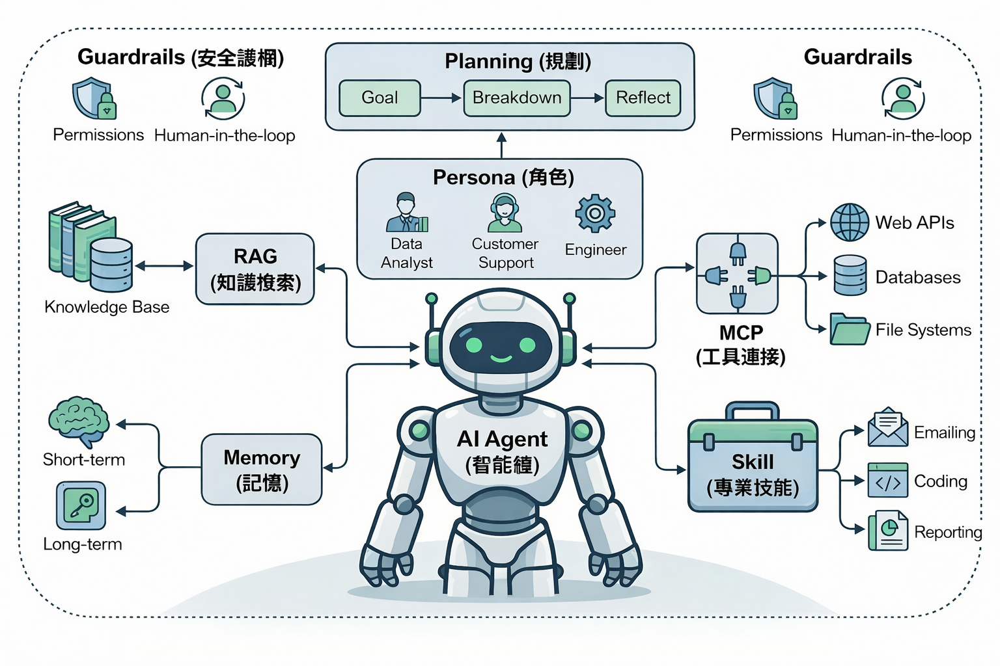

# 範例專案 Demo

簡介
- 這是一個最小化的專案骨架，用於示範 Demo、文件與推上 GitHub 的流程。

快速啟動（Windows / 跨平台）

需求：瀏覽器、選用 Python 3（用來啟動本地靜態伺服器，可選）。

本地查看 Demo（方式一：直接開啟）
1. 在檔案總管中打開 `demo/index.html`，或用瀏覽器開啟該檔案。

本地查看 Demo（方式二：啟動簡單 HTTP 伺服器）
```bash
# 在專案根目錄執行（需要 Python 3）
python -m http.server 8000
# 然後在瀏覽器開啟： http://localhost:8000/demo/index.html
```

初始化 git 並推上 GitHub（替換 USERNAME/REPO）
```bash
git init
git add .
git commit -m "chore: initial scaffold"
git branch -M main
git remote add origin git@github.com:USERNAME/REPO.git
git push -u origin main
```

授權
- 預設使用 MIT 授權（可在 `LICENSE` 中修改）。

檔案結構（重點）
- `demo/`：示範的靜態頁面（`index.html`）。
- `docs/index.md`：專案說明與文件首頁。
- `README.md`：快速啟動與說明（本檔）。

## 專案架構圖

以下為本專案的架構示意圖（將顯示 `assets/architecture.png`）：


若您已將圖檔上傳為 `assets/architecture.png`，此處會直接顯示；否則請將您剛剛上傳的圖片存為該檔名，或允許我替您把附件加入至該路徑。

## 智能體

以下為智能體示意圖：



### 智能體說明

1. 🧠 **核心大腦區：認知與決策（中間與上方）**

	這是 Agent 能夠「思考」的關鍵所在。

	- **AI Agent (智能體)**：系統的總指揮，負責接收指令並協調所有組件。
	- **Persona (角色)**：賦予 Agent 特定的身分，例如「資深業務助理」或「客服技術專家」，會影響思考邏輯、語氣與優先事項。
	- **Planning (規劃)**：面對複雜任務時的運作引擎，包含：
	  - **Goal (目標)**：確認最終要達成什麼。
	  - **Breakdown (拆解)**：將大任務切分成可執行的小步驟。
	  - **Reflect (反思)**：執行後檢查結果並調整計畫。

2. 📚 **左腦區：知識與經驗（左側）**

	這裡負責解決 Agent「知道什麼」以及「記得什麼」。

	- **RAG (知識檢索)**：Agent 的「外掛圖書館」，透過 RAG 從 Knowledge Base 精準提取資訊，降低幻覺風險。
	- **Memory (記憶)**：
	  - **Short-term (短期記憶)**：保留當次對話上下文。
	  - **Long-term (長期記憶)**：類似資料庫，記錄過去互動、使用者習慣與專案歷史。

3. 🛠️ **右腦與雙手區：行動與技能（右側）**

	解決 Agent「能做什麼」以及「如何與外部世界互動」。

	- **MCP (工具連接)**：標準化的通用介面，讓 Agent 能呼叫 Web API、查詢 DB、或讀寫檔案系統，而無需為每個動作寫死整合程式。
	- **Skill (專業技能)**：打包好的工作流模組（例如寄送週報、撰寫程式碼、產生圖表），執行時從工具箱取用。

4. 🛡️ **邊界防護網：安全與控制（外圍虛線）**

	這是在實務中常被忽略但極為重要的一環。

	- **Guardrails (安全護欄)**：限制與約束 Agent 的行為，避免失控。
	- **Permissions (權限)**：確保 Agent 只能讀取/寫入被允許的資源。
	- **Human-in-the-loop (人機協同)**：對高風險動作（例如發送正式文件、刪除資料）採取人工審核機制，必要時暫停等待人工批准。

接下來