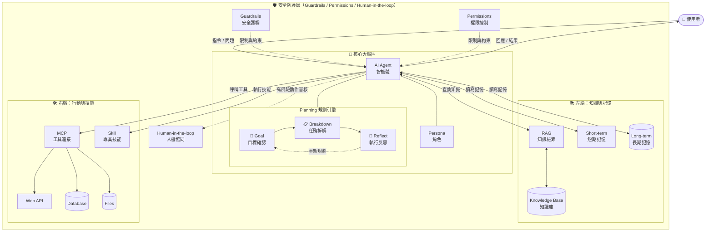

# AI 智能體架構圖

## 區塊說明

| 區塊 | 職責 |
|------|------|
| 🧠 核心大腦區 | AI Agent 總指揮，搭配 Persona 角色設定與 Planning 規劃引擎 |
| 📚 左腦：知識與記憶 | RAG 知識檢索、短期與長期記憶管理 |
| 🛠️ 右腦：行動與技能 | MCP 工具連接（API/DB/Files）與 Skill 技能模組 |
| 🛡️ 安全防護層 | Guardrails 護欄、Permissions 權限、Human-in-the-loop 人工審核 |
